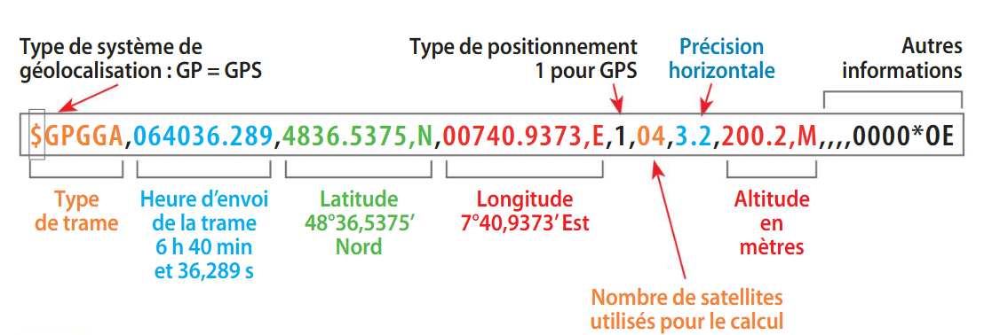

# TP Les coordonnées géographiques

!!! warning "Consignes"
    Un document réponse doit être téléversé au format PDF sur le Classroom à la fin de la séance ! Le document peut être réalisé sur LibreOffice, Google Docs etc. je vous laisse maître de vos outils.

## Définitions

### Cartographie

!!!note Cartographie
    La **cartographie** est l'étude et la réalisation de cartes. Cela inclut la collecte de données sur un lieu, la représentation de ces données sur une carte, et l'utilisation de ces cartes pour aider à comprendre et à naviguer dans un endroit.

La **cartographie** est essentielle pour beaucoup d'activités, comme le transport, l'agriculture, l'urbanisme, les loisirs, l'épidémiologie ou encore la guerre. Elle a été révolutionné et popularisé par les **cartes numériques** accessibles depuis les ordinateurs, tablettes ou téléphones, en étant plus intuitives à utiliser que les cartes papier. Ces dernières ont été systématiquement numérisées à la fin du 20e siècle.

Les cartes numériques rassemblent toutes les échelles et permettent de montrer différents 
aspects de la région visualisée sur une seule carte. Les **algorithmes de recherche** permettent de retrouver sur la carte les endroits en donnant simplement leur nom, et de calculer des itinéraires entre points selon des modes de transports variés.

### Géolocalisation

!!!note "Géolocalisation"
    La géolocalisation est le processus de déterminer la **position géographique** d'un objet ou d'une personne sur la Terre.
    
Le principal instrument de localisation, GPS (*Global Positioning System*), a été conçu par 
l’armée américaine dans les années soixante. Le premier satellite GPS fut lancé en 1978. Il y 
en a actuellement une trentaine, de sorte qu’à tout moment quatre à six satellites au moins 
sont visibles depuis tout point de la Terre. Couplé aux cartes numériques, le système GPS 
permet de se situer. Il n’est pas toujours efficace en ville, et peut être complété par d’autres 
moyens de localisation comme la détection de bornes Wi-Fi proches. D’autres systèmes plus 
précis, dont Galileo, sont en cours de déploiement.

## Se repérer sur Terre

S'il est facile de localiser un point dans le plan grâce à un repère cartésien, malheureusement, la Terre n'est pas une surface plane. Comment alors situer un point sur une sphère ?

!!! Example "Petit jeu d'énigmes"
    Alice participe à jeu d'énigmes sur le Web et doit retrouver 4 sites et les placer sur un planisphère. Les indices à sa disposition sont :

    * A : `33° 51' 25" S, 151° 12' 55" E`

    * B : `-25.694171, -54.436646`

    * C : `45° 15' 23" N, 5° 01' 43" E`

    * D : `$GPGGA,114535.288,7814.1500,N,01529.4833,E,1,04,3.2,325,M,,,,0000*0E`

    Aidez Alice grâce aux différentes aides ! Les questions se situent après.

## Latitude et Longitude

!!!note "Aide 1 - Latitude et Longitude"
    Tout point sur le globe peut être localisé à l'aide d'une grille imaginaire de lignes "verticales" et "horizontales" :
    
    <figure markdown>
    
    </figure>

    Un point se repère relativement à deux cercles :

    * L'**équateur** qui sépare le pôle Nord du pôle Sud.

    * La **méridien de Greenwich**, qui est le cercle passant les pôles Nord et Sud et l'observatoire de Greenwhich, en Angleterre.

    <figure markdown>
    
    </figure>

    De l'équateur on définit des **parallèles**, et du méridien de Greenwhich, d'autres **méridiens**. Ainsi :

    * La **latitude** correspond à l'**angle** formé entre l'équateur et la parallèle passant par le point.

    * La **longitude** correspont à l'**angle** formé entre le méridien de référence (ou de Greenwhich) et le méridien passant par le point.

    <figure markdown>
    
    </figure>

    * Les latitudes sont notée de -90° à 90°. Les angles négatifs correspondent à l'hémisphère sud, les angles positifs correspondent à l'hémisphère nord.

    * Les longitudes sont notée de -180° à 180°. Les longitudes négatives sont situées à l'ouest de Greenwhich, Les longitudes positives sont situées à l'est de Greenwhich. On peut aussi noter O pour Ouest et E pour Est.

    Par convention, la latitude est donnée en premier, la longitude en second.

## Mesurer les angles

!!!note "Aide 2 - Le système sexagésimal"
    Le **système sexagésimal** ou **DMS** pour *Degrés Minutes Secondes* vient des Babyloniens, inventeurs du degré et qui comptaient en base 60. Il permet de noter plus simplement des angles précis et éviter un trop grand nombre de chiffres après la virgule.

    Le système DMS est divisé en trois parties : les degrés (°), les minutes (') et les secondes ("). **Un degré est divisé en 60 minutes, et une minute est divisée en 60 secondes.**

    Ce système n'accepte pas les valeurs négatives, ainsi N et S sont ajoutés aux latitudes poud distinguer le Nord du Sud, et O et E sont ajoutés aux longitudes pour distinguer l'Ouest de l'Est.

    Par exemple, la latitude de Paris est `48° 51' 12" N`.

!!! Example "Question 1"
    Combien y a-t-il de secondes dans un degré ?

!!!note "Aide 3 - Le sytème décimal"
    Dans le **système décimal**, ou sytème DD (degrés décimaux); les angles sont simplement mesurés en degré, ce que vous aviez l'habitude de faire jusqu'à présent. Dans ce système, les angles négatifs sont autorisés. Par exemple, la latitude de Paris vaut `48.853333°`.

    Pour arriver à ce résultat, on peut convertir `48° 51' 12" N` en degrés :

    $$
        48 + \frac{51}{60} + \frac{12}{60 \times 60} = 48.853333
    $$

    On se situe bien au nord de l'hémisphère, donc le signe est bien positif.
    
### Protocole NMEA

!!!note "Aide 4 - Le Protocole NMEA 0183"
    C'est un des protocoles qui régit les communications des récepteurs GPS. Les normes de ce protocole sont définies et contrôlées par la National Marine Electronics Association (NMEA). Une trame de ce protocole se décompose comme suit :

    

    La latitude est au format `DDMM.MMMM` et la longitude au format `DDDMM.MMMM`.

## Questions

!!! example "Question 2 - Identification"
    Identifiez selon quel système ou quel protocole est exprimé pour chacun des quatres sites (A, B, C et D).

!!! example "Question 3"
    Quels sont les sites situés dans l'hémisphère nord ?

!!! example "Question 4"
    Télécharger la carte et placer approximativement les 4 points avec un logiciel de dessin, comme Paint par exemple :

    

    Dans quels pays se trouvent-ils ?

!!! example "Question 5"

    Trouver les lieux cachés derrières les indices, à l'aide de cartes en ligne comme Géoportail, OpenStreeMap, Google Maps etc. Des sites de conversion comme [celui-ci](https://www.coordonnees-gps.fr/conversion-coordonnees-gps) peuvent vous aider.

!!! example "Question 6"

    Trouver le nom des villes les plus proches de chaque site à l'aide de cartes en ligne.