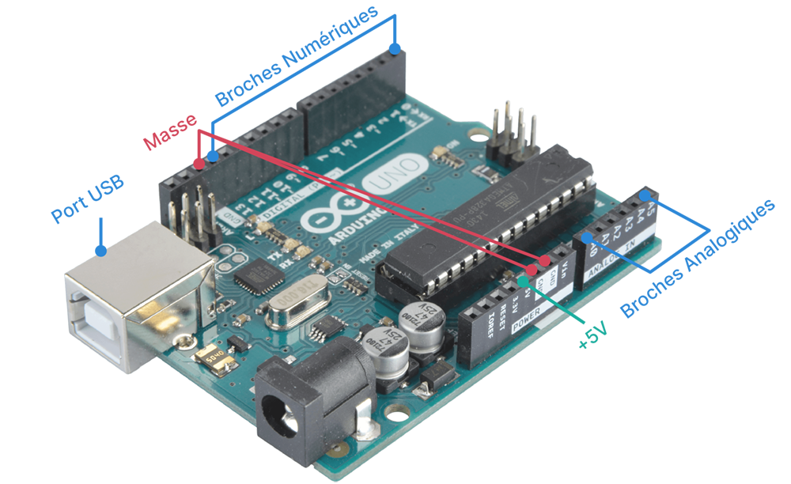
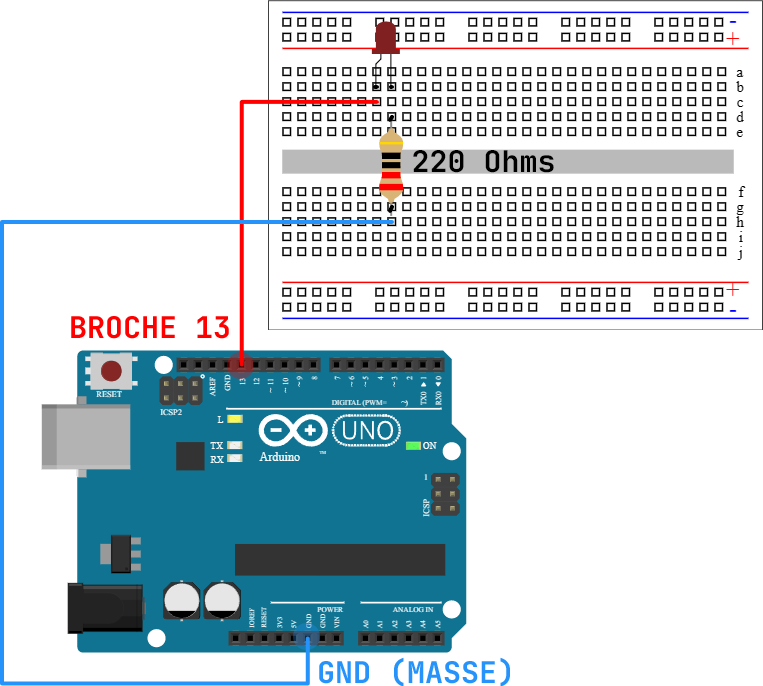
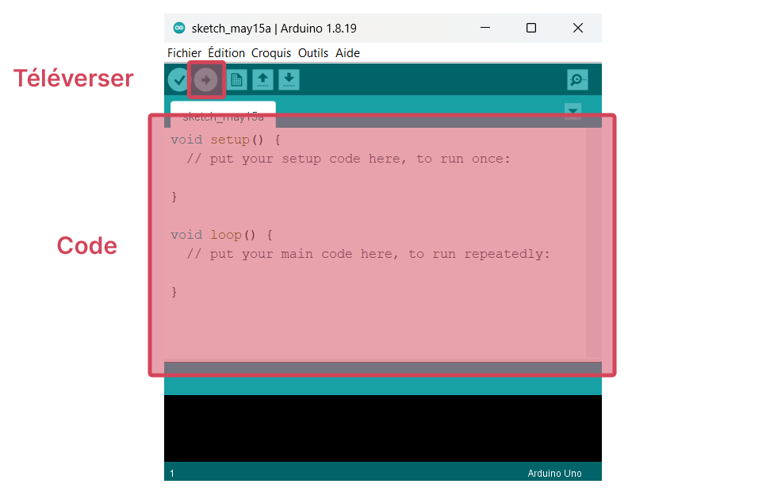
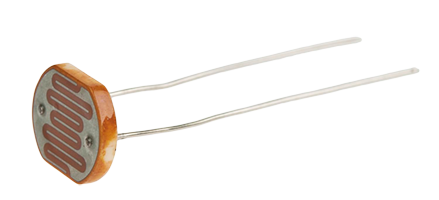
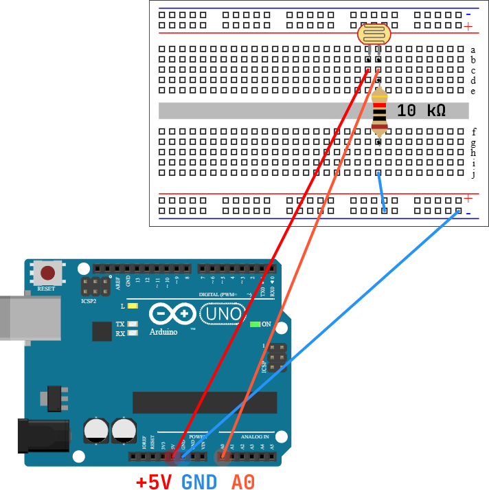

# TP Arduino - Informatique embarquée

!!! warning "Consignes"
    Mettez-vous par binôme ou trinôme suivant le nombre de cartes Arduino disponibles. Il n'y a pas de rapport à réaliser, simplement des démonstrations à me montrer. 

## Présentation du matériel utilisé

### Carte Arduino

<figure markdown>
{ width=400px }
</figure markdown>

Arduino Uno est une petite **carte électronique programmable** qui permet de contrôler différents composants électroniques tels que des lumières, des moteurs ou des capteurs. Elle est largement utilisée pour l'apprentissage de l'**électronique embarquée** et de la programmation.  

### Breadboard

<figure markdown>
{ width=400px }
</figure markdown>

La **Breadboard** permet de réaliser des circuits électroniques sans soudure, il suffit d'insérer les pattes des composants et les fils dans les trous de celui-ci pour réaliser des branchements.

## :fontawesome-solid-lightbulb: Clignoter une LED

!!! success "Objectif"
    Cette section a pour but de vous familiarisez avec le matériel, il s'agira de faire clignoter une LED.

??? info "Matériels nécessaires"
    * Un PC avec le logiciel Arduino
    * Une carte Arduino Uno
    * Un câble USB
    * Une breadboard
    * Une LED rouge
    * Une résistance de 220 Ω
    * Quelques fils électriques

### Le montage

* Réaliser le montage suivant :

<figure markdown>
{ width=400px }
</figure markdown>


??? info "Schéma électrique"
    <figure markdown>
    { width=200px }
    </figure markdown>

!!! warning "Attention au sens de la LED"
    Une LED est un semi-conducteur qui laisse passer le courant que dans un sens ! La branche la plus longue sur la borne + et la branche la plus courte sur la borne -.

> Une LED a été simplement connectée à une des sorties de la carte Arduino, ici sur la broche (*pin* en anglais) 13. La résistance ajoutée permet de limiter le courant dans la LED. On se propose maintenant  de contrôler la LED grâce à un programme.

### Le programme

* Relier la carte Arduino au PC grâce au câble USB. 

* Exécuter le logiciel **Arduino** sur votre PC.
  
> Le logiciel **Arduino** permet d'écrire un programme que l'on envoie ensuite vers la carte Arduino grâce à un câble USB. Une fois le programme envoyé à la carte, il sera exécuté par la carte.

<figure markdown>

</figure markdown>

* Copier-coller le programme suivant :

```c
void setup()
{
    // la fonction setup se lance une fois au démarrage du programme
    pinMode(13, OUTPUT); //(1)!
}


void loop()
{
    // la fonction loop se répète à l'infini
    digitalWrite(13, HIGH); //(2)!
    delay(1000); //(3)!
    digitalWrite(13, LOW); //(4)!
    delay(1000); //(5)!
}
```

1. On déclare la broche 13 sur laquelle la LED est branchée comme une sortie (*output* en anglais) de la carte Arduino ; on veut y envoyer du courant !

2. On envoie du courant à la broche 13, la LED s'allume. La sortie 13 est dite à l'état « haut » (*high* en anglais).

3. On attend 1 seconde, la LED reste donc allumée pendant ce temps.

4. On met la sortie de la broche 13 à l'état « bas » (*low* en anglais), la LED s'éteint.

5. On patiente 1 seconde. Le code dans `loop()` se répète ensuite, d'où le clignotement.

<div></div>

* Transférer le programme à la carte en cliquant sur le bouton { width="20px" }.

* Si tout fonctionne, la LED devrait se mettre à clignoter.

!!! question
    Modifier le programme pour faire clignoter la LED plus rapidement.

    M'appeler pour une démonstration.

## :material-help-circle: Message SOS

??? info "Le code morse"
    Le code morse est un système de communication utilisé pour transmettre des messages en utilisant des signaux sonores ou lumineux. Ce système utilise des combinaisons de points, de traits et d'espaces pour représenter des lettres, des chiffres et des signes de ponctuation.

    Dans le code morse, un point représente une courte durée d'émission de signal, tandis qu'un trait représente une durée plus longue. Les lettres sont formées en combinant des points et des traits dans des séquences spécifiques.
    
    <figure markdown>
    { width="300" }
    </figure markdown>

??? info "Durées"
    * Un **point** `.` dure 1 unité de temps
    * Un **tiret** `-` dure 3 unités de temps 
    * La durée entre deux symboles (`.` ou `-`) d'une même lettre est d'1 unité de temps
    * La durée entre les lettres est de 3 unités de temps
    * La durée entre les mots est de 7 unités de temps


!!! question
    Sans modifier le montage électronique précédent, adapter le programme précédent afin de faire clignoter la LED pour afficher le message « SOS » en code morse.

    M'appeler pour une démonstration.

    Ce n'est pas obligatoire, mais pour rendre la tâche moins pénible, vous pouvez vous aider des quelques techniques présentées ci-dessous. 

??? note "Quelques techniques"

    === "Définir l'unité de temps"
        On peut définir des **constantes** au préalable dans notre programme :

        ```c
        #define UNITE_TEMPS 200 //(1)!

        void setup()
        {
        }

        void loop()
        {
            delay(UNITE_TEMPS * 3); //(2)!
        }
        ```

        1. On définit une **constante** `UNITE_TEMPS` qui vaut 200. On pourra la modifier si besoin.

        2. On réutilise la constante `UNITE_TEMPS` pour attendre 3 unités de temps, soit 200 × 3 = 600 ms.

        Ainsi il sera très facile de modifier `UNITE_TEMPS` pour accélérer ou ralentir le clignotement de la LED.

    === "Définir la broche de la LED"
        Un autre exemple de constante utile :

        ```c
        #define LED 13 //(1)!

        void setup()
        {
            pinMode(LED, OUTPUT); 
        }

        void loop()
        {
            digitalWrite(LED, HIGH);
        }
        ```

        1. De la même manière, on peut définir la broche où est connectée la LED pour plus de clarté. Ici, la constante `LED` vaut 13.

        Ceci est très utile lorsque de multiples composants sont connectés à la carte (plusieurs LEDs, un buzzer etc.).

    === "Définir une fonction"
        Pour éviter de répéter du code, on utilise une **fonction** :

        ```c
        void ma_super_fonction()
        {
            digitalWrite(13, HIGH);
            delay(100);
            digitalWrite(13, LOW);
            delay(100);
        }

        void setup()
        {
            pinMode(13, OUTPUT); 
        }

        void loop()
        {
            // ma_super_fonction est exécutée 3 fois !
            ma_super_fonction();
            ma_super_fonction();
            ma_super_fonction();
            delay(1000);
        }
        ```

    === "Un début de programme"
        Ainsi, pour répondre à la question, une manière de faire serait de réaliser deux fonctions `point` et `tiret` et de les appeler dans la fonction principale `loop`.

        ```c
        #define UNITE_TEMPS 200
        #define LED 13

        void point()
        {
            // à compléter
        }

        void tiret()
        {
            // à compléter
        }

        void setup()
        {
            // à compléter
        }

        void loop()
        {
            // à compléter
        }

        ```

## Mini-projet

!!! warning "Consignes"
    Choisir un des mini-projets A ou B. Le projet A me semble plus abordable.

### :material-lightbulb-auto: Mini-projet A : Un lampadaire intelligent

!!! success "Objectif"
    Quand la nuit tombe, la plupart des lampadaires s'allument automatiquement. Pour détecter la baisse de luminosité, ce genre de lampadaire est doté d'un **capteur photosensible**, c'est-à-dire sensible à la lumière. Le but de ce projet est de réaliser un tel lampadaire.

??? note "Une photorésistance"
    <figure markdown>
    { width=200px }
    </figure markdown>

    Une **photorésistance** est un composant électronique dont la résistance électrique diminue lorsqu'il est exposé à la lumière. Dans ce projet, la carte Arduino lira plutôt **la tension** aux bornes de ce capteur car elle est proportionnelle à sa résistance (loi d'Ohm).

    > En résumé, mesurer la tension aux bornes de ce capteur photosensible mesure la quantité de lumière qu'il reçoit.
    
    Un tel signal est dit **analogique** car il varie de manière continue dans le temps. Les valeurs de ce signal seront ensuite converties en des valeurs numériques que vous manipulerez dans le programme.

??? info "Matériels nécessaires"
    * Un PC avec le logiciel Arduino
    * Une carte Arduino Uno
    * Un câble USB
    * Une breadboard
    * 1 × LED rouge
    * 1 × résistance de 220 Ω
    * 1 × résistance de 10 kΩ 
    * 1 × photorésistance
    * Quelques fils électriques

??? question "Démarche"


    * Réaliser le circuit suivant :

        <figure markdown>
        { width=400px }
        </figure markdown>

        ??? info "Schéma électrique"
            <figure markdown>
            { width=200px }
            </figure markdown>

    * Téléverser ce code à la carte Arduino :

        ```c
        #define PHOTORESISTANCE A0 //(1)!
        
        void setup()
        {
            Serial.begin(9600); //(2)!
            pinMode(PHOTORESISTANCE, INPUT); //(3)!
        }
        
        void loop()
        {
            int valeur = analogRead(PHOTORESISTANCE); //(4)!
            Serial.println(valeur); //(5)!
            delay(200);
        }
        ```

        1. Définit la broche sur laquelle est connectée la photorésistance (ici, la broche analogique A0)

        2. Initialise la communication avec le PC. 9600 bauds correspond au nombre de symboles transmissibles par seconde.

        3. Initialise la broche A0 comme une entrée (*input* en anglais).

        4. Mesure la tension sur la broche A1, le résultat est stocké dans une variable `valeur` de type entier `int`.

        5. On affiche la valeur sur le PC.

        <div></div>

    * Dans le logiciel Arduino, ouvrir le moniteur série `Outils ▶ Moniteur série` pour afficher les messages qu'envoie la carte Arduino au PC.

    * Noter les valeurs affichées sur le moniteur lorsque :
        * le capteur n'est pas couvert
        * le capteur est couvert (avec un doigt par exemple)
        * qu'une source lumineuse est proche du capteur (le flash de d'un téléphone par exemple)

    * Ajouter une LED à votre circuit comme lors de la première section (n'oubliez pas la résistance !).

    * Modifier le programme suivant pour allumer la lumière quand la photorésistance détecte la nuit :

        ```c
        #define PHOTORESISTANCE A0
        #define LED ❓
        
        void setup()
        {
            Serial.begin(9600);
            pinMode(PHOTORESISTANCE, INPUT);
            pinMode(❓)
        }
        
        void loop()
        {
            int valeur = analogRead(PHOTORESISTANCE);
            Serial.println(valeur); 

            if (valeur >= ❓) // si...
            {
               ❓
            }
            else // sinon
            {
               ❓
            }

            delay(200);
        }
        ```


    * M'appeler pour une démonstration.

### :material-signal-variant: Mini-Projet B : Radar de recul
!!! success "Objectif"
    Les voitures modernes sont dotés d'un radar de recul permettant d'aider le conducteur à détecter des obstacles proches lorsqu'il est en marche arrière. Un tel radar est doté d'un **capteur de distance**. Le but de ce projet est de réaliser un tel radar de recul.


??? note "Capteur de distance à ultrasons"

    <figure markdown>
    { width=200px }
    </figure markdown>

    Un capteur de distance à ultrasons envoie une petite onde acoustique ultrasonique (40 kHz) et reçoit l'écho de cette onde plus tard. La durée $\Delta T$ entre l'émission de l'onde et la réception de son écho permet de calculer la distance car la vitesse $v$ du son dans l'air est connue :

    $$2d = v \cdot \Delta T$$

    Le coefficient $2$ vient du fait que l'onde acoustique parcourt deux fois la distance (aller-retour) entre l'émetteur et l'objet visé.


??? info "Matériels nécessaires"
    * Un PC avec le logiciel Arduino
    * Une carte Arduino Uno
    * Un câble USB
    * Une carte BaseShield
    * Un capteur de distance à ultrasons
    * Au choix :
        * 5 × LED rouge et 5 × résistance de 220 Ω
        * Un buzzer
    * Quelques fils électriques

??? question "Démarche"

    * Connecter le BaseShield à la carte Arduino. Y relier le capteur de distance à ultrasons sur des bornes, par exemple la borne 7.

    >  Pour utiliser le capteur, il est nécessaire d'utiliser une bibliothèque spécifique qui contient toutes les fonctions utiles. Par exemple la fonction `MeasureInCentimeters` permettra de renvoyer la distance mesurée par le capteur, sans se soucier de l'implémentation concrète.

    * Télécharger la bibliothèque du capteur ultrason [CapteurUltrason.zip](images/CapteurUltrason.zip). Dans le logiciel Arduino, inclure la bibliothèque en allant dans `Croquis ▶ Inclure une bibliothèque ▶ Ajouter la bibliothèque .ZIP...` et sélectionner le fichier précédemment téléchargé.

    <figure markdown>
    {width=600px}
    </figure markdown>

    * Copier et téléverser le programme suivant :

        ```c
        #include "Ultrasonic.h" //(1)!

        Ultrasonic ultrasonic(7); //(2)!

        void setup()
        {
            Serial.begin(9600); //(3)!
        }

        void loop()
        {
            long distance = ultrasonic.MeasureInCentimeters(); //(4)!
            Serial.println("La distance à l'obstacle devant est : ");
            Serial.print(distance); //(5)!
            Serial.println(" cm");
            delay(250); //(6)!
        }
        ```

        1. On inclut la bibliothèque `Ultrasonic` qui contient les fonctions utiles pour le capteur de distance à ultrasons.

        2. On spécifie la borne où l'on a attaché le capteur sur le BaseShield.

        3. Initialise la communication avec le PC. 9600 bauds correspond au nombre de symboles transmissibles par seconde.

        4. `MeasureInCentimeters` renvoie la distance à l'obstacle en centimètres, le résultat est stocké dans une variable `distance` de type `long` (un « grand » entier).

        5. On affiche la valeur sur le PC.

        6. Deux mesures doivent être espacées dans le temps !

    * Dans le logiciel Arduino, ouvrir le moniteur série `Outils ▶ Moniteur série` pour afficher les messages qu'envoie la carte Arduino au PC. Vérifier bien que tout fonctionne.

    * On souhaite maintenant aider le conducteur avec une aide sonore ou visuelle. Vous êtes libre de réaliser au choix :

        === "Aide visuelle"
            Une **chaîne de 5 LEDs** qui s'allument inversement proportionnellement à la distance mesurée. Une chaîne de 5 LEDs allumées signifie que la voiture est proche de l'obstacle, une chaîne de 0 LED allumée signifie que la voiture est loin de l'obstacle.

            Pour démarrer, il est nécessaire de connecter 5 LEDs à 5 broches numériques de la carte Arduino (utiliser 5 résistances de 220Ω). Puis ensuite d'allumer et d'éteindre ces LEDs en fonction de la distance mesurée par le capteur grâce à une structure conditionnelle :

            ```c
            long distance =  ultrasonic.MeasureInCentimeters();

            if (distance < 5) // si...
            { 
                // code à exécuter si distance < 5cm
            }
            else if (distance < 10) // sinon si la distance < 10cm
            { 
                // code à exécuter si 5cm < distance < 10cm
            }
            else if (distance < 20) // sinon si la distance < 20cm
            { 
                // code à exécuter si 10cm < distance < 20cm
            }
            // etc.
            else // sinon (dernier cas) 
            {
                // code à exécuter par défaut
            }
            ```

        === "Aide sonore"
            Un **buzzer** qui sonne à une fréquence inversement proportionnelle à la distance mesurée. Plus la voiture est proche de l'obstacle, plus le buzzer sonne rapidement. 

            Commencer par connecter le buzzer à la broche numérique 11 de la carte Arduino par exemple. Téléverser ensuite ce code pour vérifier que tout fonctionne :

            ```c
            #define BUZZER 11 //(1)!

            void setup()
            {
                pinMode(BUZZER, OUTPUT); //(2)!
            }

            void loop()
            {
                tone(BUZZER, 523); //(3)!
                delay(500);
                tone(BUZZER, 659);
                delay(500);
                noTone(BUZZER); //(4)!
                delay(500);
            }
            ```

            1. On définit la broche où est connectée le buzzer.

            2. On déclare la broche où est connectée le buzzer comme une sortie.

            3. On fait sonner le buzzer à une fréquence de 523 Hz, soit un Do.

            4. On arrête de faire sonner le buzzer.
   
            Il faudra adapter ensuite la structure conditionnelle `if` `else if` `else` vue précédemment : soit on rallonge le délai plus la distance est grande, soit on augmente la fréquence quand on se rapproche.

    * M'appeler pour une démonstration.