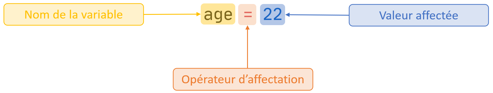
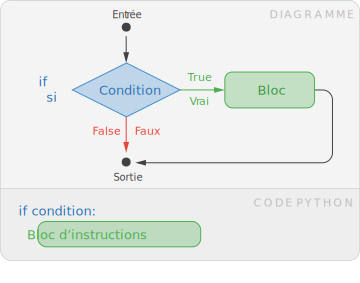
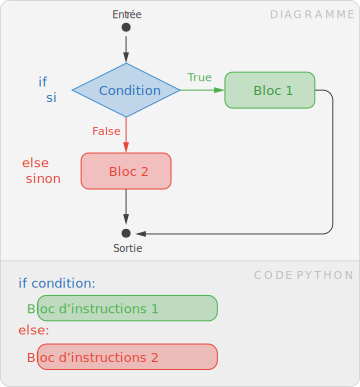
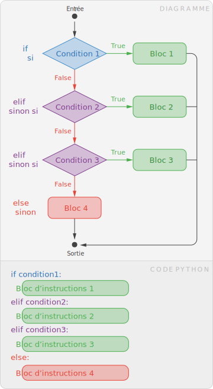

# Feuille de Triche

[Diaporama](prog.pdf)

## Types et Valeurs

Un programme manipule des données, plus précisement des **valeurs**. On distingue
4 types de valeurs.

### Les 4 types primitifs

| Type             | Terme anglais | Signification                | Exemples de valeur                            |
| ---------------- | ------------- | ---------------------------- | --------------------------------------------- |
| `#!python int  ` | integer       | Nombre entier                | `#!python 45` `#!python -255` `#!python 1998` |
| `#!python float` | float         | Nombre décimal (ou flottant) | `#!python 3.1412` `#!python -1.14152`         |
| `#!python str  ` | string        | Chaîne de caractères (texte) | `#!python "Bonjour"` `#!python "42"`          |
| `#!python bool ` | boolean       | Booléen                      | `#!python True` `#!python False`              |

### Conversions entre types

Pour passer d'un type à l'autre, on utilise les fonctions `#!python int`,
`#!python float`, `#!python str` ou `#!python bool`.

```py
int(17.6)  # float ► int, renvoie 17
int("42")  # str   ► int, renvoie 42
str(3.14)  # float ► str, renvoie "3.14"
```

## Variables

Une variable permet de **stocker** une valeur.

### Affectation

L'instruction d'affection s'écrit :



On parle d'**initialisation** lors de la première affectation.

### Réutilisation

Le contenue d'une variable peut être réutilisé :

```py
x = 42
y = x + 1  # la variable x est remplacée par la valeur qu'elle contient, 42
# y vaut maintenant 43
```


## Opérateurs Arithmétiques

### Entre deux valeurs arithmétiques (`#!python int` ou `#!python float`)

| Opérateur Arithmétique | Signification                              | Exemple              | Résultat        |
| ---------------------- | ------------------------------------------ | -------------------- | --------------- |
| `#!python +`           | Addition                                   | `#!python 10 + 3`    | `#!python 13`   |
| `#!python -`           | Soustraction                               | `#!python 42 - 10.5` | `#!python 31.5` |
| `#!python *`           | Multiplication                             | `#!python 7 * 8`     | `#!python 56`   |
| `#!python /`           | Division                                   | `#!python 13 / 5`    | `#!python 2.6`  |
| `#!python //`          | Division entière                           | `#!python 13 // 5`   | `#!python 2`    |
| `#!python %`           | Reste dans la division entière (ou modulo) | `#!python 13 % 5`    | `#!python 3`    |
| `#!python **`          | Puissance                                  | `#!python 4 ** 3`    | `#!python 64`   |

Les calculs suivent la priorité usuelle des opérateurs (par exemple, `#!python *`, `#!python /`
puis `#!python +`, `#!python -`).

```py
resultat = 10 - 2 * 3
# resultat contient 4
```

### Entre d'autres types

Les opérateurs arithmétques ont un sens différent suivant le type de valeurs manipulées.
Par exemple, on peut utiliser des chaînes de caractères :

```py
"Oui" + "Non"  # Concaténation, renvoie "OuiNon"
"Oui" * 3  # renvoie "OuiOuiOui"
```


## Entrée / Sortie

### Fonction `#!python print`

La fonction `#!python print` permet d'afficher des valeurs. Elle peut prendre
plusieurs paramètres.

```py
print("Bonjour")

x = 42
print("La variable x vaut ", x)
```

### Fonction `#!python input`

La fonction `#!python input` permet de récupérer une saisie utilisateur au clavier.
Elle renvoie une chaîne de caractères.


```py
saisie = input() # input renvoie une chaîne de caractère 
saisie = input("Saisir une entrée :") # input peut aussi afficher un message

nombre = int(input()) # conversion de l'entrée clavier vers un entier
```

## Conditions

### Ecrire une condition

#### Opérateurs de comparaison

Les opérateurs de comparaison renvoie un **booléen** : soit `#!python True` (vrai),
soit `#!python False` (faux).

| Opérateurs de comparaison | Signification       | Exemple           | Résultat         |
| ------------------------- | ------------------- | ----------------- | ---------------- |
| `#!python ==`             | égal à              | `#!python 1 == 1` | `#!python True`  |
| `#!python !=`             | différent de        | `#!python 1 != 1` | `#!python False` |
| `#!python >`              | supérieur à         | `#!python 2 > 0`  | `#!python True`  |
| `#!python >=`             | supérieur ou égal à | `#!python 4 >= 6` | `#!python False` |
| `#!python <`              | inférieur à         | `#!python 5 < 5`  | `#!python False` |
| `#!python <=`             | inférieur ou égal à | `#!python 5 <= 5` | `#!python True`  |

#### Opérateurs logiques

Les opérateurs logiques permettent de combiner des conditions. Ils fonctionnent
entre deux booléens.

| Opérateurs logiques | Signification | Exemple                   | Résultat         |
| ------------------- | ------------- | ------------------------- | ---------------- |
| `#!python not`      | non logique   | `#!python not True`       | `#!python False` |
| `#!python and`      | et logique    | `#!python False and True` | `#!python False` |
| `#!python or`       | ou logique    | `#!python False or True`  | `#!python True`  |

Quelques exemples :

| Exemple                       | Signification                   |
| ----------------------------- | ------------------------------- |
| `#!python x >= 2 and x <= 10` | x est entre 2 **et** 10         |
| `#!python x == 5 or x == 10`  | x est égal à 5 **ou** égal à 10 |
| `#!python not x == 42`        | x n'est pas égal à 42           |

### Structure conditionnelle `#!python if` (si)

<figure markdown>
{ display=block, width="350px"}
</figure>

La clause `#!python if` (si) permet d'exécuter un bloc d'instructions (code identé) si la condition est évaluée à `#!python True`.

```py
age = 22
if age >= 18:
    print("Vous êtes majeur")
```

### Structure conditionnelle `#!python if else` (si, sinon)

<figure markdown>
  { width="350px" }
</figure>

La clause `#!python else` (sinon) permet de spécifier en plus un bloc d'instructions à exécuter si la condition est évaluée à `#!python False`. 

```py
age = 22
if age >= 18:
    print("Vous êtes majeur")
else:
    print("Vous êtes mineur")
```


### Structure conditionnelle `#!python if elif else` (si, sinon si, sinon)

<figure markdown>
  { width="350px" }
</figure>

La clause `#!python elif` (else if, sinon si) permet de gérer plusieurs conditions. Si une condition n'est pas validée, la suivante est étudiée. Une telle structure conditionnelle peut contenir une ou plusieurs clauses `#!python elif`.

```py
note = int(input("Saisissez votre note au bac :"))
print("Votre mention est :")
if note >= 16:
    print("Félicitations")
elif note >= 14:
    print("Bien")
elif note >= 12:
    print("Assez Bien")
else:
    print("Pas de mention")
```

## Boucles

### Boucle bornée `#!python for` (pour)

### Boucle non-bornée `#!python while` (tant que)